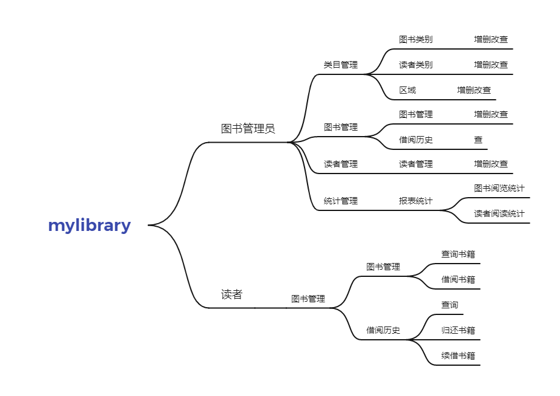
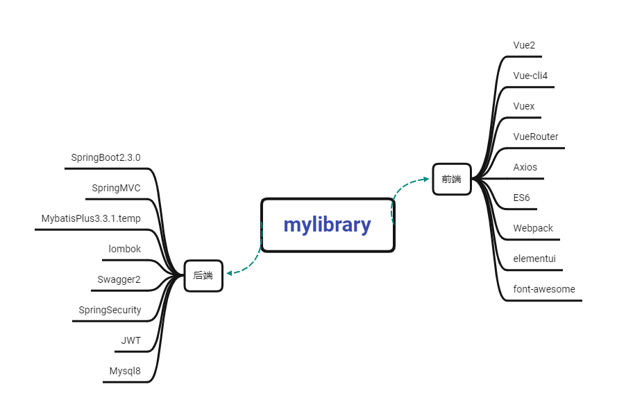
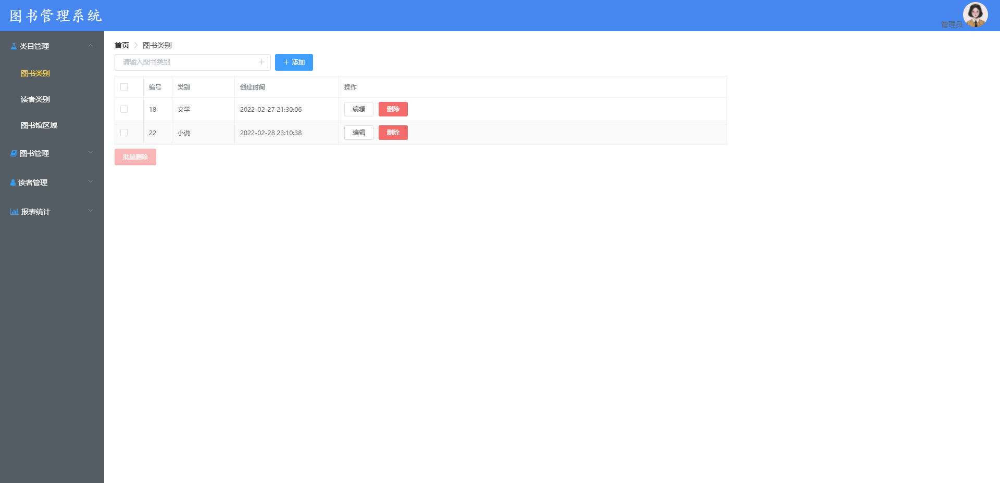
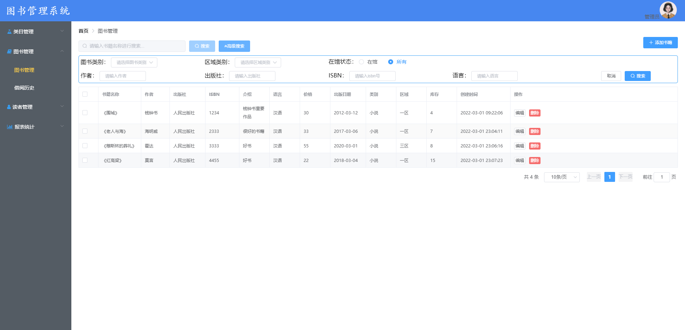
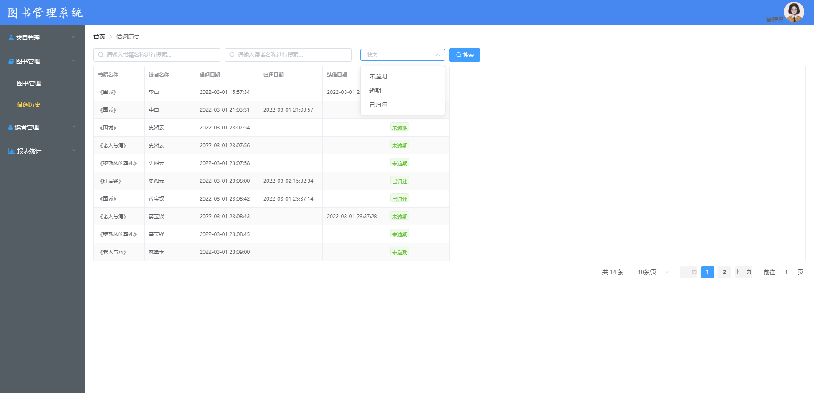
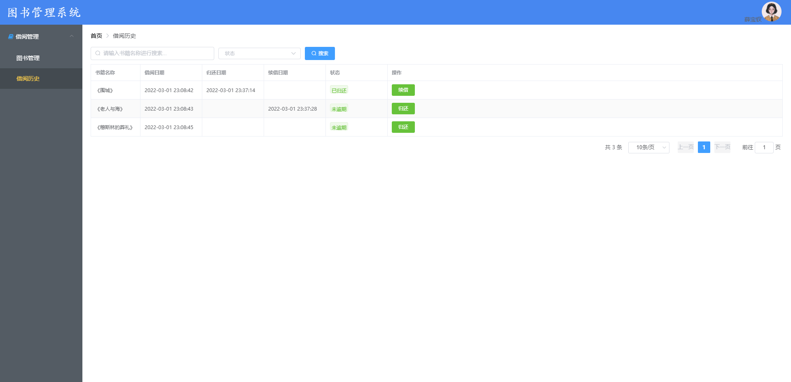
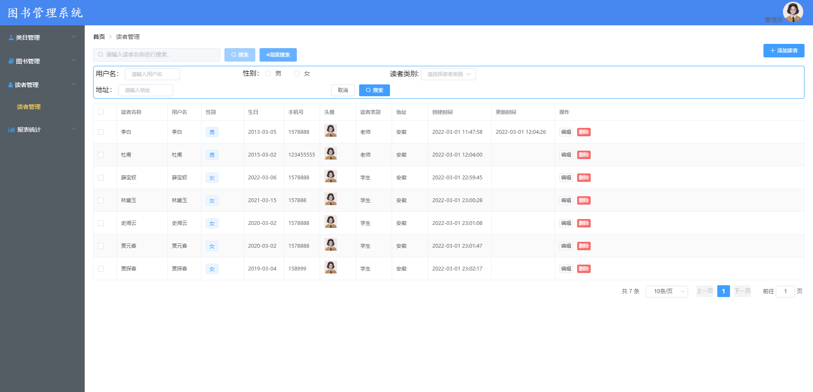
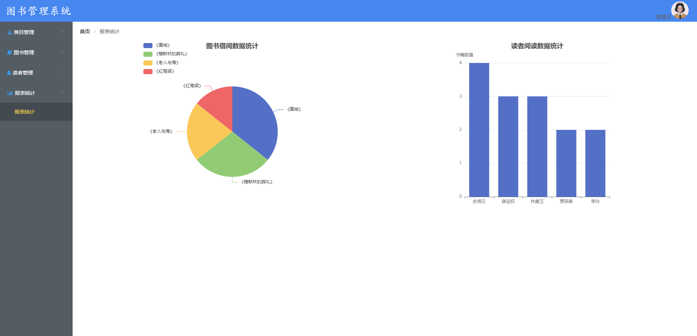

<h1 align="center"> mylibrary &nbsp; 🚀 &nbsp; 图书管理系统  </h1>

​    
    
    
    
    

---

>项目采用前后端分离开发模式，包括类别管理，图书管理，读者管理，报表统计

###  项目

#### 业务

#### 模块划分

- library-server: 业务模块,所有与业务相关的代码放在此工程中。
- library-generator: 采用Mybatis-Plus代码生成器，生成Controller,Service,ServiceImpl,Mapper,Mapper.xml，pojo。

#### 技术栈

#### 项目运行

后端：sql文件导入数据库后，启动项目

接口文档：localhost:28081/doc.html

前端：执行npm  install后，npm run serve运行项目即可，登录密码123

#### 演示页面

类目

图书

借阅

读者

统计

### 交流

我的email是yrainy2021@163.com

